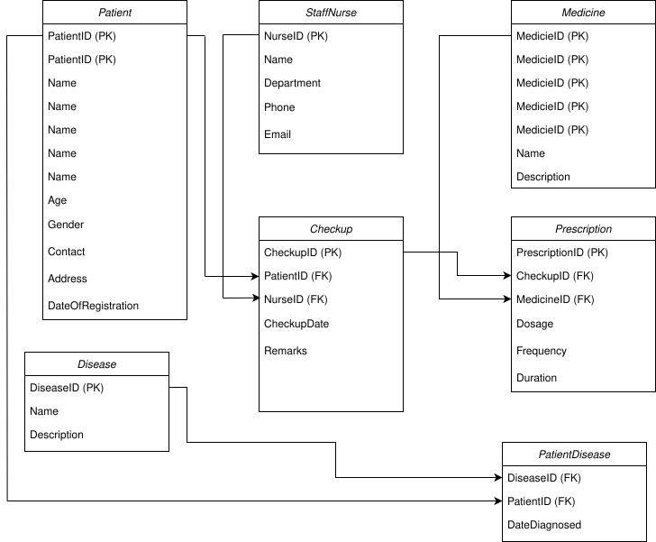

# 🗄️ Database Schema & ER Diagram

This document describes the relational database schema supporting the backend system for the frontline healthcare Android app. It captures the relationships between Patient, StaffNurse, Checkup, diseases, PatientDisease, Prescription and Medicine — designed with **data integrity**, **query performance**, and **encryption efficiency** in mind.

---

## 📊 ER Diagram

> Refer to the following ER diagram for the full data model:

---

## 🧩 Entities
Patient, Staff Nurse, Checkup, Disease, Medicine, Prescription

---

## RELATIONAL SCHEMA
- Patient Table
Patient(
    PatientID INT PRIMARY KEY,
    Name VARCHAR(100),
    Age INT,
    Gender VARCHAR(10),
    Contact VARCHAR(20),
    Address TEXT,
    DateOfRegistration DATE
);

- Staff Nurse Table
StaffNurse(
  NurseID INT PRIMARY KEY,
  Name VARCHAR(100),
  Department VARCHAR(50),
  Phone VARCHAR(20),
  Email VARCHAR(100)
);

- Checkup Table
Checkup(
  CheckupID INT PRIMARY KEY,
  PatientID INT,
  NurseID INT,
  CheckupDate DATETIME,
  Remarks TEXT,
  FOREIGN KEY (PatientID) REFERENCES Patient(PatientID),
  FOREIGN KEY (NurseID) REFERENCES StaffNurse(NurseID)
);

- Disease Table
Disease(
  DiseaseID INT PRIMARY KEY,
  Name VARCHAR(100),
  Description TEXT
);

- PatientDisease Table
PatientDisease(
  PatientID INT,
  DiseaseID INT,
  DateDiagnosed DATE,
  PRIMARY KEY (PatientID, DiseaseID),
  FOREIGN KEY (PatientID) REFERENCES Patient(PatientID),
  FOREIGN KEY (DiseaseID) REFERENCES Disease(DiseaseID)
);

- Medicine Table
Medicine(
  MedicineID INT PRIMARY KEY,
  Name VARCHAR(100),
  Description TEXT
);

- Prescription Table
Prescription(
  PrescriptionID INT PRIMARY KEY,
  CheckupID INT,
  MedicineID INT,
  Dosage VARCHAR(50),
  Frequency VARCHAR(50),
  Duration VARCHAR(50),
  FOREIGN KEY (CheckupID) REFERENCES Checkup(CheckupID),
  FOREIGN KEY (MedicineID) REFERENCES Medicine(MedicineID)
);

## 🔐 Encryption Strategy for Secure & Fast Processing
For healthcare data, security and performance are critical.  we use AES-256 (Advanced Encryption Standard) for encrypting sensitive columns like:

### ✨ Encrypted Fields

- `Patient.Contact`, `Patient.address`
- `StaffNurse.phone`
- `Checkup.notes`
- `Disease.description`

### 🛡️ Example:
- Use column-level encryption in PostgreSQL (pgcrypto) or MySQL (AES_ENCRYPT function).
  - Encrypt example
    UPDATE Patient
    SET Contact = AES_ENCRYPT('9876543210', 'encryption_key')
    WHERE PatientID = 1;

### 🔑 Key Management
- Encryption keys managed by **AWS KMS**
- Envelope encryption pattern
- Regular **key rotation** policy every 90 days
- Only specific microservices allowed decryption via IAM roles

### 🚀 Performance Optimization
- Avoid encrypting fields used for filtering/sorting unless critical
- Indexing, hashing, and efficient querying strategies

---

## 🧠 Summary

This schema allows:

- Complete tracking of patient lifecycle: registration → checkup → diagnosis → treatment
- Strong **referential integrity**
- Secure storage of personal and medical data
