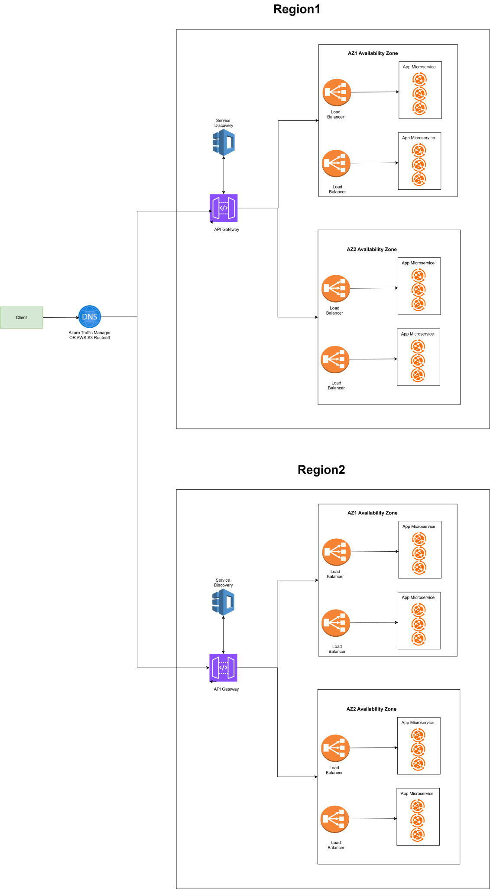

# 🏗️ System Architecture Documentation

## 📌 Overview

This document describes the detailed system architecture for the backend system supporting an Android application used by frontline healthcare workers. The system is designed with a **high-availability**, **scalable** approach. It ensures that the platform can serve health workers reliably in both connected and remote areas while handling **2000+ requests per second (RPS)**.

---

## 📐 Architecture Diagram

> Refer to the following diagram for the overall system design:

---

## 🧩 Components and Interactions

### 1. Client Application (Android)
- The end-user (e.g., health worker’s Android app) interacts with the backend system through the API Gateway, facilitated by DNS routing.
- Client uses HTTPS to ensure secure communication.

### 2. Global DNS (Route 53 or Azure Traffic Manager)
- Acts as a global DNS-based load balancer that detects the health of regional deployments.
- If Region 1 fails, traffic is automatically routed to Region 2.
- Enables Geo Routing, Failover, and Latency-based Routing.
### High Availability Justification:
- Automatic region-level failover using DNS + Health Checks.
- Avoids a single point of failure.

### 3. API Gateway (Per Region)
- Accepts and routes incoming API requests to the internal Node.js microservices.
- Can enforce:
    - Rate limiting
    - Authentication
    - Request transformation
- Serves as the first layer of protection and traffic control in each region. 

### 4. Load Balancer (Per Region)
- Distributes traffic across multiple microservice instances
- Performs **health checks**
- Scales services horizontally
### High Availability Justification:
- If a regional API Gateway goes down, DNS redirects to another region's gateway.
- Can be auto-scaled and deployed redundantly.

### 5. Service Discovery (e.g., AWS Cloud Map)
- Keeps track of all healthy service instances (Node.js microservices) running in the region.
- API Gateway queries service discovery to know where to route the request.
- When microservices scale up or down, service discovery auto-registers/deregisters them.

### 6. Load Balancer (Per Region)
- Distributes incoming traffic to multiple Node.js microservice instances.
- Ensures even distribution and removes dead instances from rotation.
- When microservices scale up or down, service discovery auto-registers/deregisters them.
### 2000 RPS Handling Justification:
- Supports horizontal scaling of backend services (e.g., 10 instances handling 200 RPS each).
- Load balancers are stateless and lightweight, built for high throughput.

### 7. App Microservices (Multiple Instances in Each Region)
- Built in Node.js (non-blocking, event-driven), perfect for handling high concurrent I/O.
- Communicate with **region-specific databases**
### High Throughput Design:
- Microservices are stateless and independently scalable.
- If 2000 RPS required:
- Run 10+ service instances per region, each handling ~200 RPS.
- Can be auto-scaled with CPU or RPS metrics.

---

## ⚙️ High Availability Mechanisms

| Layer          | Strategy                                                  |
|----------------|-----------------------------------------------------------|
| DNS            | Geo-routing, region failover                              |
| API Gateway    | Deployed per region, rate limiting, high availability     |
| Load Balancer  | Multi-AZ, round-robin/load-aware distribution             |
| Microservices  | Stateless, containerized, auto-scaled via ECS/K8s         |

---

## 📊 2000 RPS Handling Strategy

| Layer          | Scaling Strategy                                          |
|----------------|-----------------------------------------------------------|
| Node.js API    | Async, non-blocking I/O with clustering                   |
| Load Balancer  | Auto-scales microservices based on CPU/memory thresholds  |
| DB Layer       | Optimized indexing, caching, connection pooling           |
| API Gateway    | Token Bucket or Sliding Window rate limiting              |
