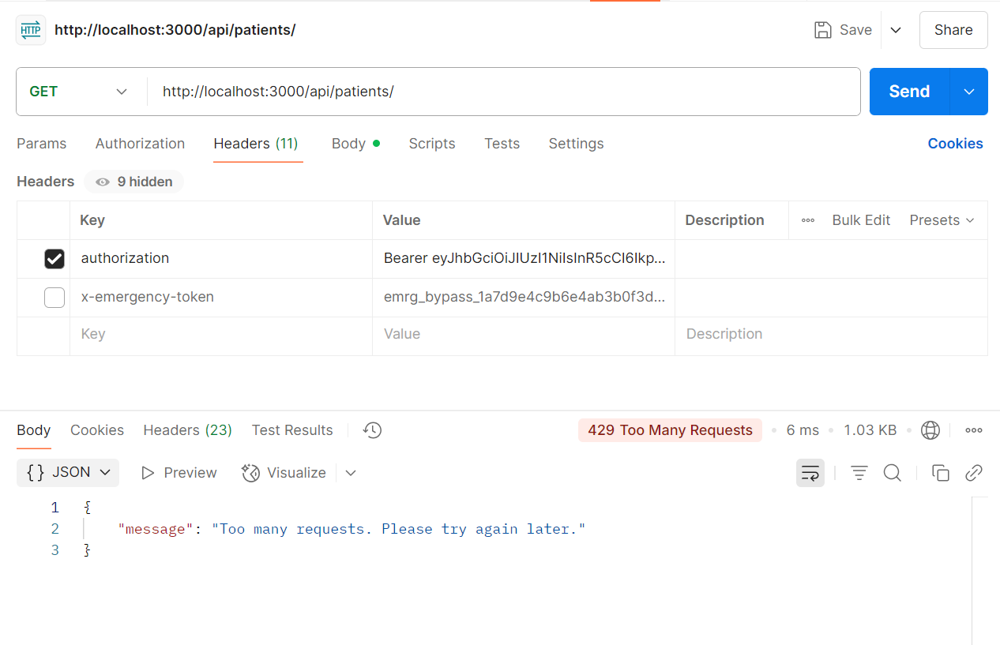

# ⚙️ Rate Limiting Strategy

This document describes the **Rate Limiting Strategy** implemented in the backend system for a healthcare application to protect against abuse, ensure fair usage, and maintain system stability.

---

## 📌 Overview

To support **high availability** and handle up to **2000+ requests per second**, this system uses **distributed rate limiting** backed by **Redis**. It applies **different limits for different user roles**, supports **emergency bypass**, and communicates limits using standard headers.

---

## 🛠️ Technologies Used

- **express-rate-limit** for rate limiting
- **rate-limit-redis** for distributed store
- **Redis** for storing rate limit metadata across servers
- **JWT** for identifying users and roles

---

## 📐 Design Approach

### 🔧 Algorithms Used

- **Token Bucket** (default in `express-rate-limit`)
- **Sliding Window** (can be configured if needed, but Token Bucket is default)

### 👤 Role-Based Limits

| Role   | Limit           |
|--------|------------------|
| admin  | 1000 req/min     |
| nurse  | 100 req/min      |
| guest  | 10 req/min       |

### 🆘 Emergency Bypass

- Requests containing the header `x-emergency-token` with a valid value (stored in `.env`) will bypass all rate limits.

---

## 🧱 Implementation Details

### 1️⃣ Redis Client Setup

```js
const { createClient } = require('redis');

const redisClient = createClient({
  url: process.env.REDIS_URL,
});

redisClient.on('connect', () => {
  console.log('✅ Redis connected successfully');
});

redisClient.connect().catch(console.error);

### 2 rateLimiterMiddleware Code Setup
// middleware/rateLimiter.js
const rateLimit = require('express-rate-limit');
const RedisStore = require('rate-limit-redis').default;
const redisClient = require('../utils/redisClient');

// Factory to create limiter
const createRoleRateLimiter = (maxRequests, windowMs = 60 * 1000) =>
  rateLimit({
    windowMs,
    max: maxRequests,
    standardHeaders: true,
    legacyHeaders: false,
    store: new RedisStore({
      sendCommand: (...args) => redisClient.sendCommand(args),
    }),
    keyGenerator: (req) => req.user?.id || req.ip,
    handler: (req, res) => {
      res.status(429).json({
        message: 'Too many requests. Please try again later.',
      });
    },
  });

// Define limiters per role
const rateLimiters = {
  admin: createRoleRateLimiter(1000),
  nurse: createRoleRateLimiter(100),
  guest: createRoleRateLimiter(10),
};

// Middleware function
const rateLimiterMiddleware = (req, res, next) => {
  const EMERGENCY_TOKEN = process.env.EMERGENCY_BYPASS;

  if (req.headers['x-emergency-token'] === EMERGENCY_TOKEN) {
    return next();
  }

  const role = req.user?.role || 'guest';

  if (role === 'admin') return rateLimiters.admin(req, res, next);
  if (role === 'nurse') return rateLimiters.nurse(req, res, next);

  return rateLimiters.guest(req, res, next);
};


## 🔐 Authentication Rate APIs

### 📥 POST `/api/patients/`

Use this API for getiing pateients list with rateLimiterMiddleware 

> 📸 Refer to the image below for the Patients List Request example:



