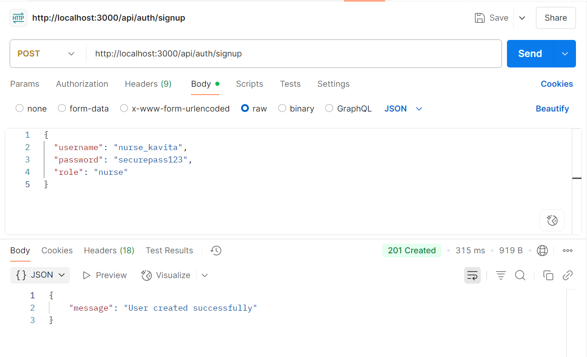
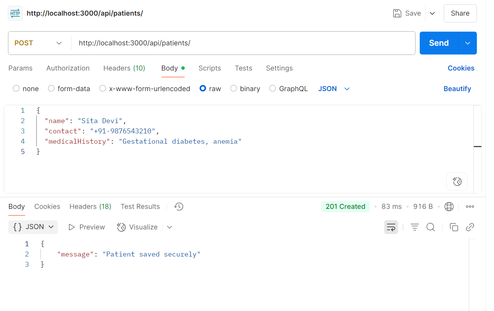
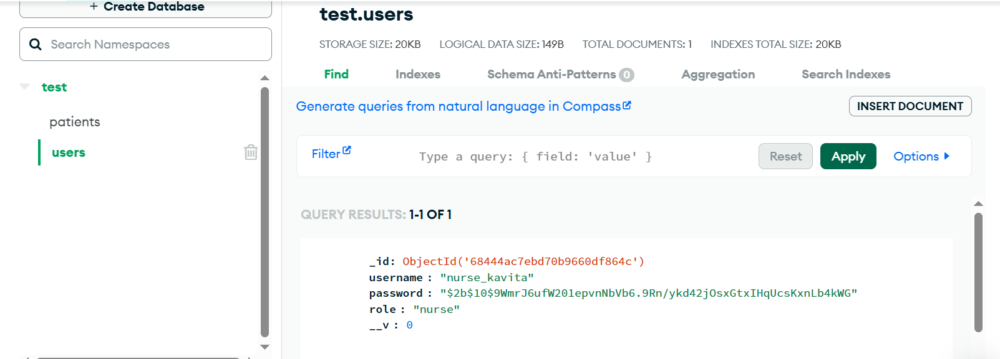
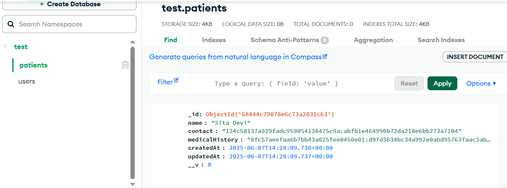

# 🔐 Security Strategy

This document outlines the **complete security plan** for the backend system of a healthcare Android app used by frontline health workers. The system protects **sensitive patient information**, ensures **secure data handling**, and enables **safe API access** with minimal performance trade-offs.

---

## 📌 Why Security Matters

The application handles **confidential medical data** such as:
- Personal patient details
- Medical history
- Checkups and treatments

To ensure **data protection**, we implement:
- 🔐 Field-level encryption
- 🧾 Encrypted communication
- 🛡️ Role-based access
- 🔑 Secure key management

## 🛡️ 1. Data Encryption

### 📡 A. Encryption In Transit

All data transferred between the client and server is encrypted using **TLS (HTTPS)**:

| Feature       | Description                          |
|---------------|--------------------------------------|
| Protocol      | HTTPS (TLS v1.3)                     |
| Middleware    | `helmet`, for setting secure headers |
| CORS Policy   | Only trusted domains are allowed     |

### 🔏 B. Encryption At Rest (Field-Level)

Only **sensitive fields** are encrypted in the database using **AES-256-CBC** encryption.

| Feature               | Details                                 |
|------------------------|------------------------------------------|
| Algorithm             | AES-256-CBC                              |
| Key Length            | 32 bytes (256-bit)                       |
| IV (Initialization Vector) | Randomly generated per document     |
| Storage Format        | `iv:ciphertext` (both Base64 encoded)   |

#### 🔐 Encrypted Fields:
- Patient **contact number**
- **Medical history**
- Any other field marked as `sensitive` in schema

---

## 🔑 2. Key Management Strategy

- Key stored in `.env` for dev; in production use **AWS KMS** 
- Key length: 32 bytes (256-bit), base64 or hex encoded
- Keys rotated every 90 days
- Role-based access to keys, with audit logging

---

## 👤 3. Authentication (Login System)

We use **JWT (JSON Web Token)** for stateless authentication.

### 🔐 Password Handling
- Passwords are **hashed** using `bcrypt`
- Stored only as hashes, never in plain text

### 🔁 Login Flow
1. User submits credentials (username + password)
2. Server verifies and generates a signed JWT
3. JWT includes user ID and role (`admin`, `nurse`, etc.)
4. Token is sent via `Authorization: Bearer <token>` header for secured routes

---

## 🛂 4. Authorization (Access Control)

### 🔒 Role-Based Access Control (RBAC)

Different users have different permissions based on roles:

| Role   | Access Scope                            |
|--------|------------------------------------------|
| admin  | Full access to all APIs and data         |
| nurse  | Can manage patient data (read/write)     |

Middleware checks roles via JWT before processing any protected route.

---

## ⚙️ 5. Performance Considerations

- Only **critical fields** are encrypted to reduce CPU usage
- **Indexes** are applied only to non-encrypted fields
- Encryption/decryption is handled by **Mongoose pre/post hooks**
- Secure, performant, and extensible design ensures smooth operations even under **high load**

## 🔐 Authentication APIs

### 📥 POST `/api/auth/signup`

Use this API to create a new user (e.g. nurse or admin).

> 📸 Refer to the image below for the Signup request body example:

---

### 🔑 POST `/api/auth/login`

Use this API to authenticate an existing user and retrieve a JWT token.

> 📸 Refer to the image below for the Login request body example:

---

## 🏥 Patient Management API

### 📝 POST `/api/patients/`

Used to create a new patient entry. Sensitive fields are encrypted.

> 📸 Refer to the image below for the Patient creation request structure:

---

## 🗂️ MongoDB Schemas

### 👤 User Schema

Fields:
- `username` (string)
- `password` (bcrypt hashed)
- `role` (`admin`, `nurse`, etc.)

📸 *See image:*

---

### 🧑‍⚕️ Patient Schema

Fields:
- `name`, `contact`, `medicalHistory`
- `createdAt`, `updatedAt`
- `contact` and `medicalHistory` are encrypted at rest

📸 *See image:*

